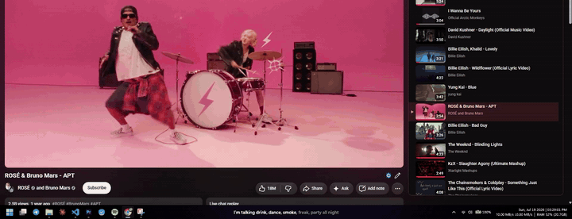
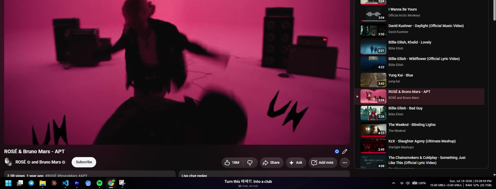

# Taskbar Lyrics
(Why do i even do this to myself...)





Synced (word-by-word, karaoke-style) lyrics rendered directly on the Windows taskbar,
for whatever is playing — Spotify, YouTube in a browser, anything that shows up in the
Windows media flyout.

## How it works

```
┌───────────────┐  ws://localhost:9012   ┌──────────────────────────────┐
│ Spotify       │ ◄────────────────────► │ TaskbarLyrics.exe (WPF)      │
│ + spicetify   │   search / lyrics /    │  • SMTC watcher (any player) │
│ spicy-bridge  │   exact position push  │  • position interpolation    │
└───────────────┘                        │  • karaoke overlay renderer  │
        │                                └──────────────────────────────┘
        ▼                                          │ fallback
  api.spicylyrics.org                              ▼
  (word-level lyrics,                         lrclib.net
   uses Spotify's own token)                  (line-level, no auth)
```

- **`extension/spicy-bridge.js`** — spicetify extension running inside Spotify. Servs
  Spotify track search + SpicyLyrics API fetches (using the client's own session token,
  same as the real Spicy Lyrics extension) and pushes exact playback position every 500ms.
- **`TaskbarLyrics/`** — .NET 8 WPF app. Listens to the Windows media session (SMTC),
  resolves lyrics (cache → SpicyLyrics via bridge → LRCLIB), renders a click-through
  always-on-top strip over the taskbar: main line with per-syllable sweep, smaller
  filler/background vocals row ("yeah", "come on"), 3-dot interlude animation.
- YouTube/browser tracks: video title + channel get cleaned (`(Official Video)`, `ft.`,
  `Artist - Title` splitting) and matched against Spotify search by title/artist/duration.

## Build & run

```powershell
cd TaskbarLyrics
dotnet build -c Release
start bin\Release\net8.0-windows10.0.19041.0\TaskbarLyrics.exe
```

Extension install (already done once):

```powershell
Copy-Item extension\spicy-bridge.js "$env:APPDATA\spicetify\Extensions\"
spicetify config extensions spicy-bridge.js
spicetify apply
```

## Config

`config.json` next to the exe (created on first run):

| key | meaning |
|---|---|
| `Placement` | `taskbar` (on the bar) or `above` (floating strip above it) |
| `Align` / `XOffset` / `Width` | horizontal position of the strip |
| `MainFontPx` / `BgFontPx` | font sizes for main + filler rows |
| `GlobalOffsetMs` | sync nudge, positive = lyrics earlier |
| `InterludeGapMs` | min instrumental gap before the ● ● ● dots |

Tray icon (♪): toggle placement, open log, clear lyrics cache, exit.

## Autostart

Create a shortcut to `TaskbarLyrics.exe` in `shell:startup`
(Win+R → `shell:startup` → paste shortcut).

## Notes

- Data: `%LOCALAPPDATA%\TaskbarLyrics\` (log.txt + lyrics cache).
- Word-level lyrics need Spotify running (the bridge lives inside it). Without it,
  LRCLIB still provides line-level sync for anything playing.
- The SpicyLyrics API is unofficial; its response notice permits personal individual
  use via official clients/forks — this is a personal single-user companion. If it
  ever blocks/changes, the LRCLIB path keeps working.
- Browser position (SMTC) can drift ~0.5s; Spotify position is exact via the bridge.
