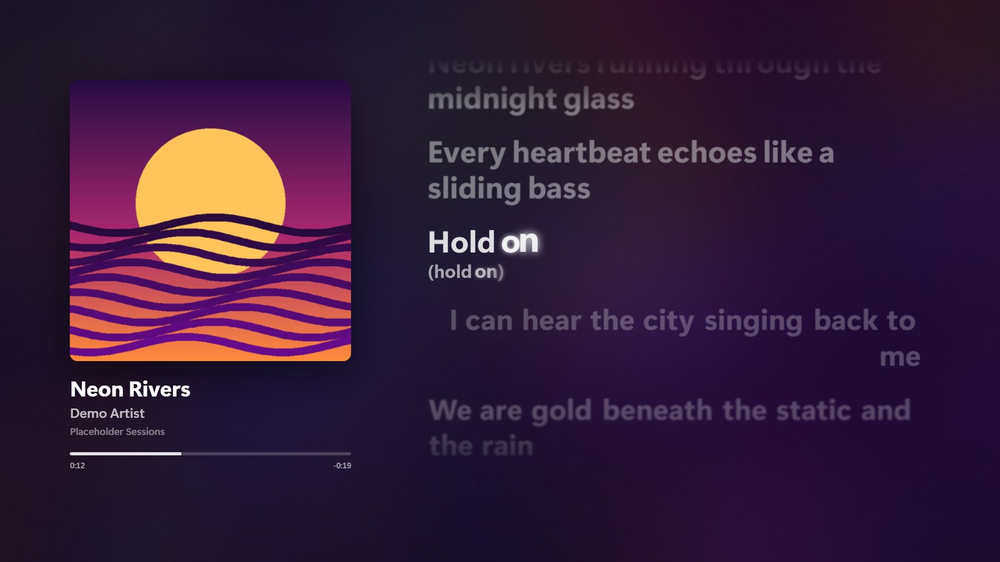
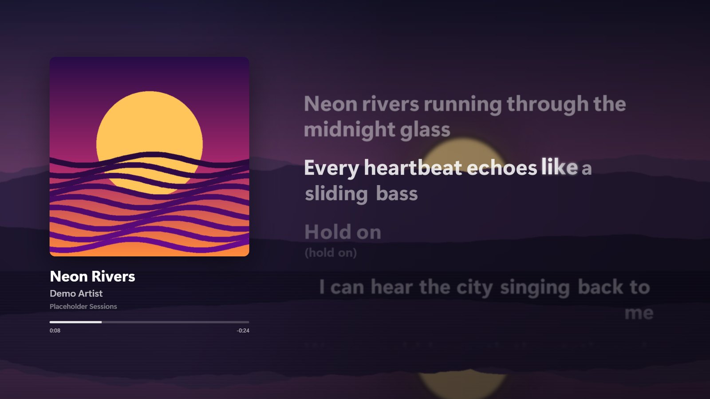
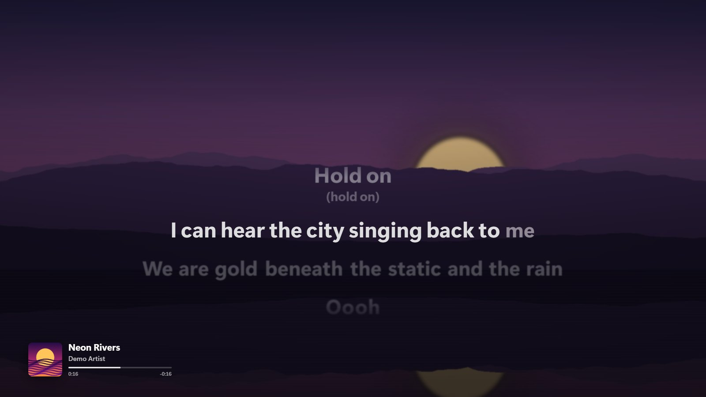
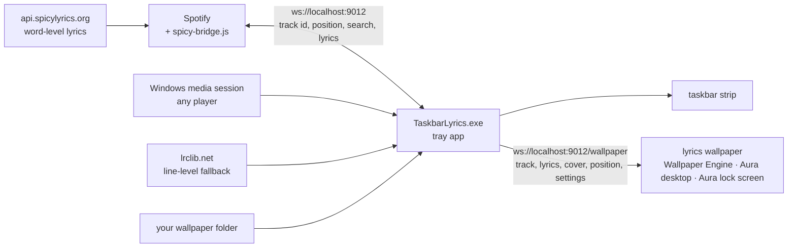

# Taskbar Lyrics
(Why do i even do this to myself...)


Synced (word-by-word, karaoke-style) lyrics for whatever is playing on Windows — Spotify,
YouTube in a browser, anything that shows up in the Windows media flyout — drawn right on
the taskbar, and optionally as a full-screen [Spicy Lyrics](https://github.com/Spikerko/spicy-lyrics)-style
**lyrics wallpaper** for the desktop and the lock screen.

| Desktop wallpaper — album gradient | Desktop wallpaper — your own images |
|---|---|
|  |  |

| Lock screen |
|---|
|  |

<sub>Screenshots use the wallpaper's built-in demo (`index.html?demo`): placeholder lyrics, generated cover and background. The empty top third of the lock screen is where Windows draws its own clock.</sub>

## Features

- **Taskbar strip** — the current line with a per-syllable sweep, background vocals
  ("yeah", "come on") as a smaller row, ● ● ● during instrumental gaps. Click-through,
  positioned anywhere along the top/bottom edge, on or above the taskbar.
- **Lyrics wallpaper** (Wallpaper Engine or Aura) — the Spicy Lyrics look full-screen:
  word gradient sweep with glow, letter-by-letter emphasis on held notes, blur on lines
  away from the current one, duet lines right-aligned, background vocals, interlude dots,
  next to a now-playing card with cover, title and progress.
- **Backgrounds** — a random image from your wallpaper folder on **every song change**
  (no repeats until the whole folder has shown, filterable by collection), or the
  animated, bass-reactive album-cover gradient.
- **Lock screen** (Aura) — its own layout: lyrics centred under Windows' clock and a
  compact now-playing strip. Keeps going while the PC is locked.
- **Any player** — word-level lyrics for Spotify through the spicetify extension;
  line-level (LRCLIB) for everything else. YouTube titles like
  `Artist - Title (Official Video)` get cleaned up and matched.
- **Extras on the taskbar** — an album-coloured audio visualizer and a macOS-style
  active-app name. Everything is set from the tray icon.

## Download

Grab the latest build from [Releases](https://github.com/kamol1dn/spicy-taskbar/releases):

| file | what it is |
|---|---|
| **`TaskbarLyrics.exe`** | the app, self-contained — just run it. No .NET install needed. |
| **`TaskbarLyrics-framework-dependent.zip`** | same app, tiny; needs the [.NET 8 Desktop Runtime](https://dotnet.microsoft.com/download/dotnet/8.0) |
| **`SpicyWallpaper.zip`** | the lyrics wallpaper (for Wallpaper Engine or Aura) |
| **`spicy-bridge.js`** | the spicetify extension that unlocks word-level Spotify lyrics |

## Setup

**1. The app.** Run `TaskbarLyrics.exe`; it lives in the tray (♪). To start it with
Windows, put a shortcut to it in `shell:startup` (Win+R → `shell:startup`).

**2. Word-level Spotify lyrics (optional).** Needs [spicetify](https://spicetify.app):

```powershell
Copy-Item spicy-bridge.js "$env:APPDATA\spicetify\Extensions\"
spicetify config extensions spicy-bridge.js
spicetify apply
```

Re-run the copy + `spicetify apply` whenever the extension updates; it only takes effect
after Spotify restarts. The log (`%LOCALAPPDATA%\TaskbarLyrics\log.txt`) then shows
`resolve: spicy lyrics ok (Syllable)`.

**3. The wallpaper (optional).** Unzip `SpicyWallpaper.zip` somewhere permanent, then:

- **Aura Wallpaper** — *Desktop Wallpaper* → **File** → `index.html`, and
  *Lockscreen Wallpaper* → **File** → `lockscreen.html`.
- **Wallpaper Engine** — link the folder into its projects, then pick **Spicy Wallpaper**
  under *My Wallpapers* (edits to the folder show up live):
  ```powershell
  New-Item -ItemType Junction -Path "<wallpaper_engine>\projects\myprojects\spicy-wallpaper" -Target "<path>\wallpaper"
  ```

Use one wallpaper app on the desktop at a time. With the wallpaper up you may want
tray → **Lyrics → Hide while the desktop is showing**, so the taskbar strip steps aside
whenever the desktop itself is in front.

## How it works



- **`extension/spicy-bridge.js`** — runs inside Spotify. Fetches SpicyLyrics with the
  client's own session token (the same way the real Spicy Lyrics extension does), searches
  Spotify for tracks playing elsewhere, and pushes Spotify's exact playback state 4× a
  second from a worker timer, so a backgrounded Spotify window can't starve it.
- **`TaskbarLyrics/`** — .NET 8 WPF app, the hub. Watches the Windows media session
  (preferring whatever is actually playing), resolves lyrics (cache → SpicyLyrics via the
  bridge → LRCLIB), interpolates the position between updates, draws the taskbar strip,
  and feeds any number of wallpapers over the `/wallpaper` socket. Wallpapers get a full
  snapshot when they connect (so a wallpaper that loads mid-song picks up at once), then
  live updates. For hosts without Wallpaper Engine's APIs (Aura) the app also lists the
  image folder and streams the bass level from its own audio capture.
- **`wallpaper/`** — plain HTML/CSS/JS, no build step. The lyric animation is a port of
  spicy-lyrics' renderer (same springs and curves); the album gradient is a WebGL warp +
  blur of the cover.

Nothing has to be started by hand beyond the app: Spotify connects to it when Spotify
starts, and wallpapers reconnect on their own whenever the app (re)starts.

## Tray menu

```
♪
├─ Lyrics         Enabled · Hide while the desktop is showing · top/bottom ·
│                 left/middle/right · edge offset · on the taskbar
├─ Active app     Enabled · same position options · font size
├─ Visualizer     Enabled · randomize on song change · edge · preset
├─ Wallpaper      Next wallpaper · Folder…
│   ├─ Desktop      background · collection · layout · lyrics size · darken ·
│   └─ Lock screen  wallpaper blur · slow zoom · bass pulse · line blur · font · clock
├─ Text shadow
├─ Open log · Clear lyrics cache
└─ Exit
```

Everything picked in the tray is saved to `config.json` and applied immediately — the
wallpaper included, which also remembers its last settings for when the app isn't
running (e.g. the lock screen before login).

## The wallpaper in detail

**Backgrounds**
- *My wallpapers*: a new random image from **Folder…** on every song change, cross-faded,
  with an optional slow zoom and blur. **Collection** narrows it to a subfolder or a
  filename prefix (`nord_a_forest.jpg` → *Nord*). If the folder is empty or its images
  won't load, it falls back to the gradient.
- *Album gradient*: the cover warped, rotated and heavily blurred in WebGL, flowing
  faster on bass hits (spicy-lyrics' "dynamic background").

**Layouts** — *Cover + lyrics* (default desktop), *Lyrics only*, and *Centred* (default
lock screen: lyrics below Windows' clock, now-playing strip bottom-left, no second clock).
A song without synced lyrics shows just the card, centred.

**Entry points and settings**

| file | used for |
|---|---|
| `index.html` | desktop (Wallpaper Engine, Aura desktop) |
| `lockscreen.html` | Aura lock screen |
| `config.js` | starting defaults, overridden by the tray |
| `project.json` | Wallpaper Engine metadata + its property panel |

Any setting also works as a URL parameter, e.g.
`file:///C:/…/wallpaper/index.html?background=dynamic&lyricssize=120`.
Open `index.html?demo` in a browser to see it without Spotify.

**Without the app** the wallpaper still shows the background and a clock; in Wallpaper
Engine its media integration also keeps the cover card and per-song images going — only
the lyrics need TaskbarLyrics.

## Config

`config.json` next to the exe (created on first run). Most of it is easier from the tray.

| key | meaning |
|---|---|
| `LyricsEnabled` | show the taskbar lyrics strip at all |
| `LyricsHideOnDesktop` | fade the strip out while the desktop itself has focus |
| `Placement` | `taskbar` (on the bar) or `above` (floating strip beside it) |
| `VPos` | screen edge for the lyrics: `bottom` or `top` |
| `Align` | `left` / `center` / `right` — moves the strip *and* the text inside it, so left-aligned lyrics start flush at the edge |
| `XOffset` | inset in px from the aligned edge (no effect while centered) |
| `Width` | max width of the strip |
| `MainFontPx` / `BgFontPx` | font sizes for main + filler rows |
| `TextShadow` | drop shadow behind all overlay text — turn off on dark wallpapers |
| `GlobalOffsetMs` | sync nudge, positive = lyrics earlier (taskbar and wallpaper) |
| `InterludeGapMs` | min instrumental gap before the ● ● ● dots |
| `AppNameEnabled` | show the focused app's name, macOS-menubar style (off by default) |
| `AppNameVPos` / `AppNameAlign` / `AppNameXOffset` | same position options as the lyrics, independently |
| `AppNameFontPx` / `AppNameAlpha` / `AppNameWidth` | appearance of the app-name strip |
| `VizEnabled` / `VizPreset` / `VizEdge` | visualizer on/off, style, screen edge (presets mirror at the top) |
| `WallpaperFolder` | the folder the wallpaper picks images from |
| `WallpaperDesktop` / `WallpaperLock` | per-surface wallpaper look (background, collection, layout, sizes, toggles) |
| `Port` | bridge port (default 9012) |

## Build from source

```powershell
cd TaskbarLyrics
dotnet build -c Release
start bin\Release\net8.0-windows10.0.19041.0\TaskbarLyrics.exe
```

The wallpaper needs no build — point Wallpaper Engine / Aura at `wallpaper/` directly.

## Notes

- Data: `%LOCALAPPDATA%\TaskbarLyrics\` (log.txt + lyrics cache).
- Word-level lyrics need Spotify running (the bridge lives inside it). Without it,
  LRCLIB still provides line-level sync for anything playing.
- The SpicyLyrics API is unofficial; its response notice permits personal individual
  use via official clients/forks — this is a personal single-user companion. If it
  ever blocks/changes, the LRCLIB path keeps working.
- The wallpaper's look follows [Spikerko/spicy-lyrics](https://github.com/Spikerko/spicy-lyrics);
  the renderer is a reimplementation, not copied code. Its font is served only to
  Spotify, so the wallpaper falls back to Segoe UI.
- Browser position (SMTC) can drift ~0.5s; Spotify position is exact via the bridge.
- Media with nothing to identify a song by (a browser tab reporting just "Instagram")
  gets no lyrics rather than a random song's.
- **Mix mode / transitions**: Spotify blends tracks and seeks the incoming one to a
  non-zero start offset. Windows' media session still names the outgoing track through
  that blend, and its position is only republished on play/pause/seek — so whenever
  Spotify owns the session and the bridge is live, its clock and track id win outright.
  The log notes any `bridge/SMTC disagree` moment.
